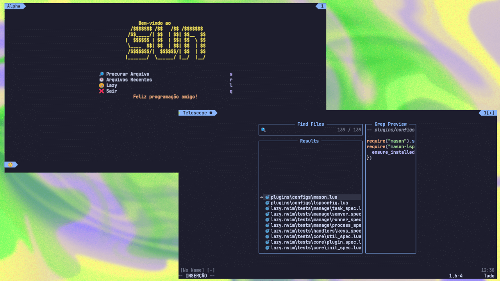
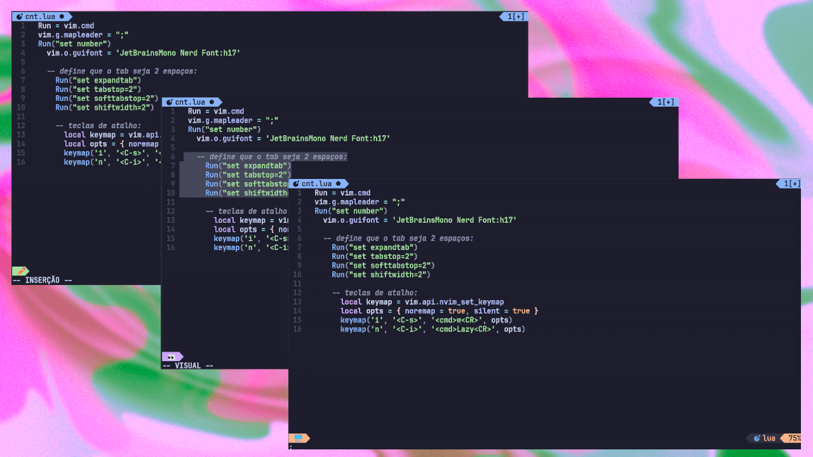

# Configurações do Neovim


Este repositório contém minhas configurações pessoais do Neovim, gerenciadas com o [Lazy](https://github.com/folke/lazy.nvim).

## Capturas de tela






## Pré-requisitos

* [Neovim](https://github.com/neovim/neovim) (versão 0.8 ou superior)
* [Git](https://git-scm.com/) (instalação do repositório)
* [nerd fonts](https://www.nerdfonts.com/) (muito importante)
* [Golang](https://go.dev/) (instalação dos pacotes do LSP)
    * Gopls (opcional, transforma o neovim numa IDE de Golang)
    * golangci-lint (opcional, verificação de código Go)

## Instalação

1.  Clone este repositório:
    no terminal do linux/mac coloque isso:
    ```bash
    git clone [https://github.com/ovodlol/.sun](https://github.com/ovodlol/.sun) ~/.config/nvim
    Remove-Item $env:LOCALAPPDATA\nvim\.git -Recurse -Force
    ```
        no terminal do windows coloque isso:
    ```bash
    git clone [https://github.com/ovodlol/.sun](https://github.com/ovodlol/.sun) $env:LOCALAPPDATA\nvim
    Remove-Item $env:LOCALAPPDATA\nvim\.git -Recurse -Force
    ```

2.  Abra o Neovim e o Lazy irá instalar automaticamente os plugins configurados no seu `laz.lua`.
    
3.  Instale as dependências do LSP de Go (se estiver usando Go):

    ```bash
    go install golang.org/x/tools/gopls@latest
    go install [github.com/golangci/golangci-lint/cmd/golangci-lint@latest](https://www.google.com/search?q=https://github.com/golangci/golangci-lint/cmd/golangci-lint%40latest)
    ```

## Uso

Minhas configurações incluem os seguintes plugins:

* **LSP:**
    * `neovim/nvim-lspconfig`: Configurações para usar com o Language Server Protocol.
    * `williamboman/mason.nvim`: Gerenciador de pacotes para LSPs, linters e formatadores.
    * `jose-elias-alvarez/null-ls.nvim`: Integra ferramentas externas como linters e formatadores como fontes LSP(vai ser trocado)

* **Interface:**
    * `goolord/alpha-nvim`: Tela de boas-vindas personalizada.
    * `nvim-telescope/telescope.nvim`: Buscador de arquivos, símbolos e outros elementos.
    * `nvim-lualine/lualine.nvim`: Barra de status personalizável.
    * `catppuccin/nvim`: Tema de cores.

* **Outros:**
    * `nvim-treesitter/nvim-treesitter`: Realce de sintaxe e informações sobre a estrutura do código.
    * `ray-x/go.nvim`: Funcionalidades específicas para a linguagem Go.

## Configurações do LSP

* O `nvim-lspconfig` é configurado para usar o `gopls` para Go.
* O `null-ls` está configurado para usar o `golangci-lint` para verificação de código Go.
* Nas próximas verções irei colocar novas configurações padrões de LSP

## Personalize

Sinta-se à vontade para modificar o arquivo `init.lua` e adicionar seus próprios plugins no laz.lua que esta no plugins/configs. O Lazy facilita a configuração e o gerenciamento de plugins.


